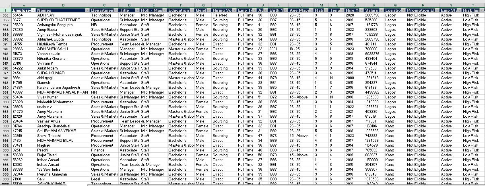
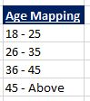
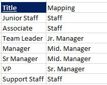
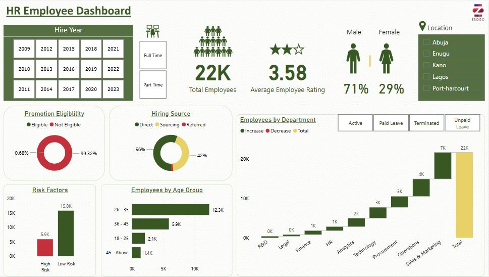

# Employee Analysis

## Introduction
In this HR analysis, I explored the analysis of employee headcount data to gain insights into the size, structure, and changes within the organization's workforce. By analyzing employee headcount data, organizations can assess their workforce composition, identify trends, and make informed decisions regarding talent management, resource allocation, and organizational planning.

## Data Sourcing

I came across the dataset online (it was a csv file). After downloading it, i opened the data in Microsoft Excel for a quick tour before importing it to Power BI for transformation, analysis and visualization.

It had just one table with 21,969 rows and 18 columns.

## Data Transformation
Two new columns were created using the Microsoft Excel funtion "vlookup" to group _Age and Title_ in the dataset.

 

While in Power BI, measures were created for the _Total Employees, Average Employee Rating, Percentage of both Male and Female count._ 

## Data Analysis and Visualization

