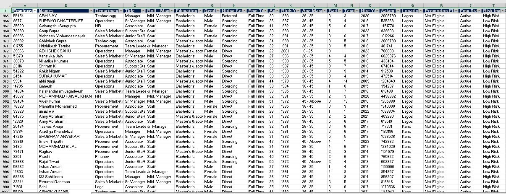
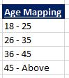
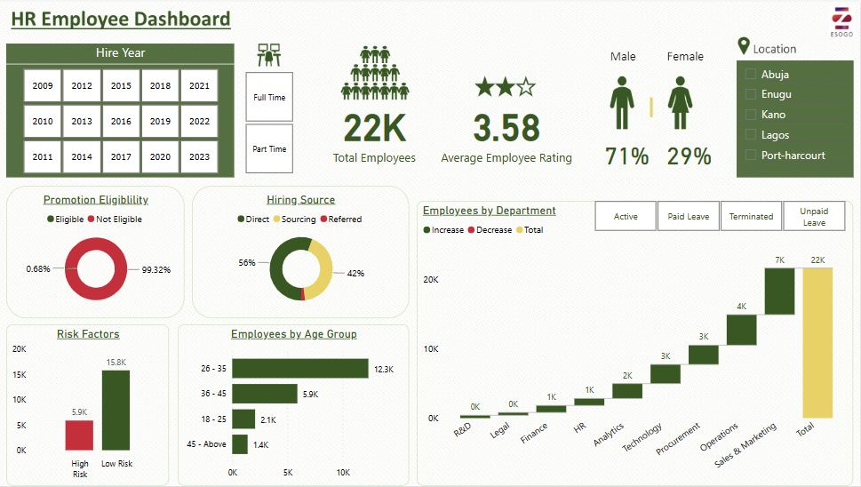

# Employee Analysis

## Introduction
I explored the analysis of employee headcount data to gain insights into the size, structure, and changes within the organization's workforce. By analyzing employee headcount data, organizations can assess their workforce composition, identify trends, and make informed decisions regarding talent management, resource allocation, and organizational planning.

## Data Sourcing

I came across the dataset online (it was a CSV file). After downloading it, I opened the data in **Excel** for a quick tour before importing it to **Power BI** for transformation, analysis and visualization.

The dataset consisted of a single table with 21,969 rows and 19 columns.

## Data Transformation
An additional column was created using the Excel funtion "IFS" to group **Age** in the dataset.

 

While in Power BI, measures were created for the **Total Employees, Average Employee Rating, Percentage of both Male and Female count.** 

## Data Analysis and Visualization

## Potential Recommendations and Insights
### 1. Gender Diversity Initiatives:
   - **Observation**: The workforce is predominantly male (71%) with females making up 29%.
   - **Recommendation**: Implement strategies to promote gender diversity and balance, especially in departments with low female representation. Consider targeted recruitment and inclusion programs to attract and retain more female employees.

### 2. Promotion and Career Development:
   - **Observation**: A very small percentage (0.68%) of employees are eligible for promotion.
   - **Recommendation**: Review and possibly revise the promotion criteria to create more opportunities for career progression. Providing more training, mentoring, and skill development programs could prepare a larger percentage of the workforce for future promotion.

### 3. Employee Retention and Risk Management:
   - **Observation**: There is a significant number of employees classified as high risk (approximately 5.9K).
   - **Recommendation**: Investigate the factors contributing to high risk and implement retention strategies such as better engagement, rewards, work-life balance programs, and addressing any dissatisfaction issues. 

### 4. Hiring and Recruitment Strategies:
   - **Observation**: The majority of hires are from direct sources (56%), followed by referrals (42%) and sourcing (2%).
   - **Recommendation**: Evaluate the effectiveness of the direct hiring method versus referrals. Increasing efforts in sourcing and diversifying recruitment channels may bring in new talent and skill sets. Strengthen the employee referral program to capitalize on high-quality candidates from existing employees' networks.

### 5. Age Group Analysis and Workforce Planning:
   - **Observation**: The age group of 26-35 years dominates the workforce (12.3K employees).
   - **Recommendation**: Ensure succession planning and knowledge transfer from this dominant age group to younger or upcoming employees. Consider policies that support both the professional growth of younger employees and the retention of experienced workers.

### 6. Departmental Workforce Distribution:
   - **Observation**: Sales & Marketing and Operations have the largest employee counts, with a steady increase in employees across departments.
   - **Recommendation**: Continue to monitor the staffing levels in critical departments to ensure they align with business goals. Assess the need for rebalancing or redistributing resources to departments that may require additional support or are showing signs of potential overstaffing.

### 7. Employee Satisfaction and Performance:
   - **Observation**: The average employee rating is 3.58.
   - **Recommendation**: Conduct a deeper analysis to understand the drivers behind employee satisfaction and performance. Implement targeted interventions to improve the average rating, such as enhancing employee engagement, offering more recognition, and addressing common concerns raised in performance reviews.

### 8. Geographical Distribution and Location-based Strategy:
   - **Observation**: Employees are distributed across various locations like Abuja, Enugu, Kano, Lagos, and Port-Harcourt.
   - **Recommendation**: Tailor employee programs and policies to reflect the unique needs and challenges of each location. Consider regional talent management strategies that align with the business goals and local market conditions.

These recommendations, derived from the dashboard insights, can guide HR strategies to improve overall employee engagement, retention, and productivity.

## Summary
Through my analysis, I gained a clear understanding of the workforce composition. The distribution of employees across departments and job categories to identify areas of concentration was examined. This analysis provided insights into the organization's structure and resource allocation.

Furthermore, I analyzed employee headcount trends over a specific period to identify patterns and changes in the workforce. By comparing headcount data across different timeframes, I assessed workforce growth, identified periods of expansion or downsizing, and examined the impact on the organization's overall workforce.

Additionally, I examined the distribution of employment status, including full-time, and part-time employees to understand the organization's workforce composition and employment arrangements.

Based on my analysis, I derived key findings and recommendations. These included optimizing workforce planning by aligning headcount with departmental needs, identifying areas for talent acquisition or development, and assessing the impact of workforce changes on organizational goals.

